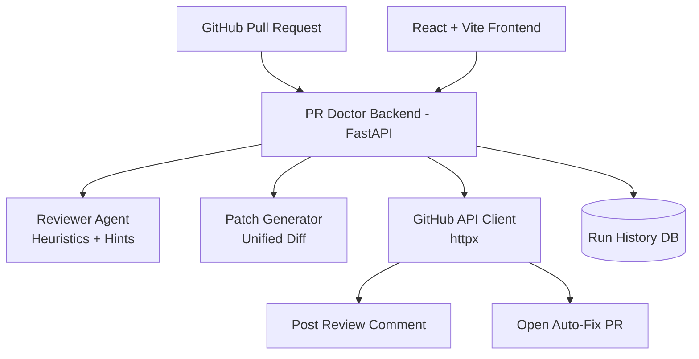
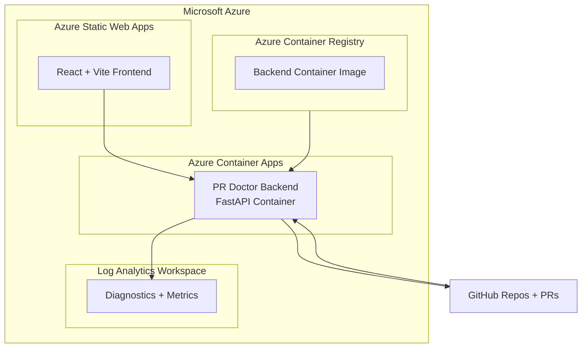

# PR Doctor 🩺 — Agentic DevOps PR Reviewer + Auto-Fix

PR Doctor is an **Agentic DevOps assistant** that helps developers and teams review GitHub Pull Requests faster and safer.

It can:
- analyze GitHub PRs for high-risk issues (secrets, debug logs, SQL injection patterns, missing tests),
- generate a safe patch (`unified diff`),
- post a structured review comment on the PR,
- and open an **auto-fix PR** with suggested corrections.

  
  
  
  
  

---

## Why PR Doctor (Real-World Problem)

In real engineering teams, code review is often delayed because reviewers are busy, security checks are inconsistent, and obvious risks (like leaked tokens or unsafe SQL) can slip into PRs.

**PR Doctor acts like a first-response reviewer**:
- catches common high-risk mistakes early,
- provides remediation guidance,
- and can create a fix PR to reduce manual effort.

### Business / Engineering Value
- **Developer velocity** (faster first-pass review)
- **Review consistency** (standard checks every PR)
- **Security hygiene** (detect risky patterns early)
- **Time-to-merge improvement** for safer changes

---

## Live Demo Proof (GitHub)

- **Demo repo:** `https://github.com/M10vir/pr-doctor-demo-repo`
- **Bad PR (test case):** `https://github.com/M10vir/pr-doctor-demo-repo/pull/1`
- **Auto-fix PR (generated by PR Doctor):** `https://github.com/M10vir/pr-doctor-demo-repo/pull/4`

> NOTE: Update the auto-fix PR link to your latest proof is newer PR.

---

## End-to-End Flow

1. **Create Run** (store PR URL + status in DB)
2. **Analyze PR** (heuristics + file/line hints)
3. **Generate Patch** (safe unified diff)
4. **Comment Review** on PR (agent action proof)
5. **Open Fix PR** (branch + commit + PR)

---

## Key Features

- ✅ PR risk analysis (baseline heuristics)
- ✅ Secret/token leak detection
- ✅ Debug logging detection
- ✅ SQL injection pattern detection (string concatenation)
- ✅ Missing tests warning
- ✅ File + line hints in findings
- ✅ Patch generation (safe unified diff)
- ✅ GitHub PR comment posting
- ✅ Auto-fix PR creation
- ✅ Run history tracking (DB-backed)

---

## Tech Stack

### Backend
- **FastAPI** (Python 3.11)
- **httpx** (GitHub REST API integration)
- **SQLAlchemy** (run history persistence)
- **python-dotenv** (local environment loading)

### Frontend
- **React**
- **Vite**
- **TailwindCSS**

### Cloud / Deployment
- **Azure Container Apps** (Backend API)
- **Azure Container Registry (ACR)** (backend image)
- **Azure Static Web Apps** (recommended for frontend)
- **Azure Log Analytics** (Container Apps diagnostics)

---

## Architecture Diagram (Application Flow)

Azure Deployment Diagram (Runtime Architecture)

---

Local Run

Backend (FastAPI)

Local secrets go in backend/.env (do not commit).

1) Create backend/.env

GITHUB_TOKEN=ghp_xxx
ALLOWED_ORIGINS=http://localhost:5173,http://localhost:4173

2) Run backend

cd backend
python -m venv .venv
source .venv/bin/activate
pip install -r requirements.txt
python -m uvicorn app.main:app --reload --port 8000

3) Test backend health

curl -s http://localhost:8000/health

---

Frontend (React + Vite)

1) Create frontend/.env

VITE_API_BASE=http://localhost:8000

2) Run frontend

cd frontend
npm install
npm run dev

---

Azure Deploy (Backend) — Azure Container Apps

Important: .env files are local only. In Azure, set secrets and environment variables on the Container App.

1) Create Resource Group + ACR

export RG="pr-doctor-rg"
export LOC="eastus"

az group create -n $RG -l $LOC

export ACR_NAME="prdoctoracr$RANDOM"
az acr create -g $RG -n $ACR_NAME --sku Basic
az acr login -n $ACR_NAME

2) Build & push backend image

Run from repo root (pr-doctor/)

az acr build -r $ACR_NAME -t pr-doctor-backend:v1 ./backend

3) Create Container Apps environment

export ENV="pr-doctor-env"
az containerapp env create -n $ENV -g $RG -l $LOC

4) Create backend Container App

export APP="pr-doctor-api"

az containerapp create \
  -n $APP \
  -g $RG \
  --environment $ENV \
  --image $ACR_NAME.azurecr.io/pr-doctor-backend:v1 \
  --registry-server $ACR_NAME.azurecr.io \
  --target-port 8000 \
  --ingress external \
  --query properties.configuration.ingress.fqdn -o tsv

Set API URL:

export API_FQDN="<FQDN_FROM_COMMAND_OUTPUT>"
export API_URL="https://$API_FQDN"

5) Set GitHub token as a secret (required)

az containerapp secret set \
  -n $APP -g $RG \
  --secrets github-token="<PASTE_GITHUB_PAT>"

az containerapp update \
  -n $APP -g $RG \
  --set-env-vars \
    GITHUB_TOKEN=secretref:github-token \
    ALLOWED_ORIGINS="http://localhost:5173,http://localhost:4173"

6) Verify deployment

curl -i -L $API_URL/health

---

Frontend Deploy (Recommended) — Azure Static Web Apps

Deploy frontend/ to Azure Static Web Apps and set:
	•	VITE_API_BASE=https://<your-container-app-fqdn>

Then update backend CORS:
	•	ALLOWED_ORIGINS=https://<your-frontend-domain>,http://localhost:5173,http://localhost:4173

---

API Endpoints
	•	GET /health
	•	GET /runs
	•	POST /runs
	•	GET /runs/{id}
	•	POST /analyze-pr
	•	POST /generate-patch
	•	POST /comment-review
	•	POST /open-fix-pr

---

Requirements

Backend (backend/requirements.txt)
	•	fastapi==0.115.0
	•	uvicorn[standard]==0.30.6
	•	python-dotenv==1.0.1
	•	httpx==0.27.2
	•	pydantic==2.8.2
	•	sqlalchemy==2.0.32

Frontend (frontend/package.json)
	•	React ^19.2.0
	•	React DOM ^19.2.0
	•	Vite ^7.3.1
	•	TailwindCSS ^3.4.17

---

Core Requirement Alignment
	•	✅ Hero technologies theme alignment: Agentic DevOps workflow
	•	✅ Azure deployment: Backend deployable on Azure Container Apps
	•	✅ GitHub-based development: Public repo + PR-based demo workflow
	•	✅ Copilot-friendly implementation path: Codebase structured for VS Code + GitHub workflow

---

Current Limitations (Transparent Notes)
	•	Reviewer is currently heuristics-based (baseline), not LLM-powered yet
	•	Patch generation is demo-safe for targeted patterns
	•	Language/framework-specific patching can be expanded in future versions

---

Roadmap (Next Improvements)
	•	LLM-based reviewer for higher precision
	•	Language-aware patch generation
	•	SARIF export / security scan format support
	•	GitHub App auth (instead of PAT for production)
	•	Role-based dashboards for team triage
	•	CI/CD integration (GitHub Actions / Azure DevOps)

---

Security Notes
	•	Never commit backend/.env
	•	Use Azure Container App secrets for GITHUB_TOKEN
	•	Rotate tokens immediately if exposed in any PR or commit

---

Contributing

This project was built as a hackathon prototype. Feedback, issues, and improvements are welcome.
	•	LinkedIn: https://www.linkedin.com/in/mohammed10vir

---

License

MIT (recommended)

---

Final Note

PR Doctor is designed as a practical, real-world developer productivity and code safety assistant.

Thank you for helping make PR Doctor better.

---
