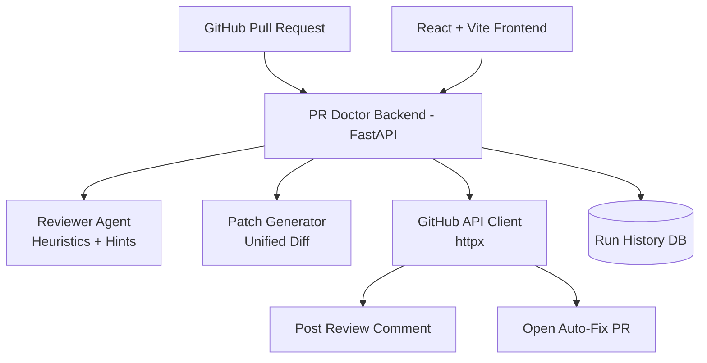
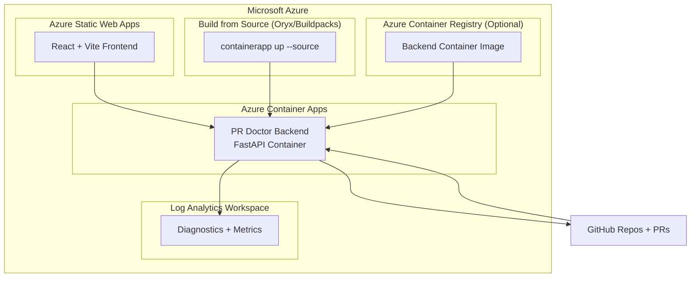

# PR Doctor 🩺 — Agentic DevOps PR Reviewer + Auto-Fix

PR Doctor is an **Agentic DevOps assistant** that helps developers and teams review GitHub Pull Requests faster and safer. It automates the analysis of high-risk patterns and proactively suggests fixes.

It can:
- analyze GitHub PRs for high-risk issues (secrets, debug logs, SQL injection patterns, missing tests),
- generate a safe patch (`unified diff`),
- post a structured review comment on the PR,
- and open an **auto-fix PR** with suggested corrections.

<p align="center">
  
</p>

<p align="center">
  
  
  
  
  
  
</p>

---

## 🌟 Why PR Doctor?

## Why PR Doctor (Real-World Problem)

In real engineering teams, code review often becomes a bottleneck: reviewers are busy, security checks are inconsistent, and obvious risks (like leaked tokens or unsafe SQL) can slip into PRs.

**PR Doctor acts like a first-response reviewer**:
- catches common high-risk mistakes early,
- provides remediation guidance,
- and can create a fix PR to reduce manual effort.

### Business / Engineering Value
- **Developer velocity** (faster first-pass review)
- **Review consistency** (standard checks every PR)
- **Security hygiene** (detect risky patterns early)
- **Time-to-merge improvement** for safer changes

---

## Live Demo Proof (Links)

### Code Repositories
- **Project repo:** https://github.com/M10vir/pr-doctor
- **Demo repo:** https://github.com/M10vir/pr-doctor-demo-repo

### Hosted Application
- **Frontend (Azure Static Web Apps):** https://wonderful-sand-095ad560f.2.azurestaticapps.net
- **Backend API (Azure Container Apps):** https://pr-doctor-api.graysand-a8a616d5.eastus.azurecontainerapps.io

### GitHub Proof
- **Bad PR (test case):** https://github.com/M10vir/pr-doctor-demo-repo/pull/1
- **Latest Fix PR (generated by PR Doctor):** https://github.com/M10vir/pr-doctor-demo-repo/pull/6

---

## Screenshots / Proof
See `/screenshots`:
- UI workflow (Analyze → Patch → Comment → Fix PR)
- GitHub comment proof
- GitHub auto-fix PR proof
- VS Code + Copilot evidence

---

## End-to-End Flow

1. **Create Run** (store PR URL + status in DB)
2. **Analyze PR** (heuristics + file/line hints)
3. **Generate Patch** (safe unified diff)
4. **Comment Review** on PR (agent action proof)
5. **Open Fix PR** (branch + commit + PR)

---

## Key Features

- ✅ PR risk analysis (baseline heuristics)
- ✅ Secret/token leak detection
- ✅ Debug logging detection
- ✅ SQL injection pattern detection (string concatenation)
- ✅ Missing tests warning
- ✅ File + line hints in findings
- ✅ Patch generation (safe unified diff)
- ✅ GitHub PR comment posting
- ✅ Auto-fix PR creation
- ✅ Run history tracking (DB-backed)

---

## Tech Stack

### Backend
- **FastAPI** (Python)
- **httpx** (GitHub REST API)
- **SQLAlchemy** (run history persistence)
- **python-dotenv** (local env loading)

### Frontend
- **React**
- **Vite**
- **TailwindCSS**

### Cloud / Deployment
- **Azure Container Apps** (Backend API)
- **Azure Static Web Apps** (Frontend)
- **Build from source (Oryx/Buildpacks)** via `az containerapp up --source` (no Docker needed)
- **Azure Container Registry (ACR)** optional (if deploying via container image)
- **Azure Log Analytics** (Container Apps diagnostics)

---

### **Application Logic**


### **Azure Deployment Diagram (Runtime Architecture)**

---

## 💻 Local Setup

### **1. Backend (FastAPI)**
Navigate to `backend/`, create a `.env` file (do not commit it), and run the server.

```bash
# Create .env
cat <<EOF > .env
GITHUB_TOKEN=ghp_your_personal_access_token
ALLOWED_ORIGINS=http://localhost:5173,http://localhost:4173
EOF

# Install & Run
python -m venv .venv
source .venv/bin/activate
pip install -r requirements.txt
python -m uvicorn app.main:app --reload --port 8000

# Test backend health
curl -s http://localhost:8000/health
```

### **2. Frontend (React + Vite)**
Navigate to `frontend/`, set your API base URL, and start the dev server.

```bash
# Set API URL
echo "VITE_API_BASE=http://localhost:8000" > .env

# Install & Run
npm install
npm run dev
```

---

## ☁️ Azure Deployment

### Option A (Recommended): Deploy from source (No Docker required) 
#### Backend: Azure Container Apps
```bash
export RG="pr-doctor-rg"
export LOC="eastus"
export ENV="pr-doctor-env"
export APP="pr-doctor-api"

az group create -n $RG -l $LOC
az containerapp env create -n $ENV -g $RG -l $LOC

az containerapp up \
  -n $APP \
  -g $RG \
  --environment $ENV \
  --source ./backend \
  --ingress external \
  --target-port 8000

# 1. Get the public URL:
export API_FQDN=$(az containerapp show -n $APP -g $RG --query "properties.configuration.ingress.fqdn" -o tsv)
export API_URL="https://$API_FQDN"
echo $API_URL
curl -i -L $API_URL/health

# 2. Set secrets/env vars:
az containerapp secret set \
  -n $APP -g $RG \
  --secrets github-token="<PASTE_GITHUB_PAT>"

az containerapp update \
  -n $APP -g $RG \
  --set-env-vars \
    GITHUB_TOKEN=secretref:github-token \
    ALLOWED_ORIGINS="http://localhost:5173,http://localhost:4173"
```

### Option B: Deploy using ACR image (Requires Docker/ACR)
```bash
export ACR_NAME="prdoctoracr$RANDOM"
az acr create -g $RG -n $ACR_NAME --sku Basic
az acr login -n $ACR_NAME
az acr build -r $ACR_NAME -t pr-doctor-backend:v1 ./backend

az containerapp create \
  -n $APP \
  -g $RG \
  --environment $ENV \
  --image $ACR_NAME.azurecr.io/pr-doctor-backend:v1 \
  --registry-server $ACR_NAME.azurecr.io \
  --target-port 8000 \
  --ingress external
```
### Frontend Deploy — Azure Static Web Apps (SWA)
```bash
# 1. Build frontend with production API base:
cd frontend
cat > .env.production <<EOF
VITE_API_BASE=https://pr-doctor-api.graysand-a8a616d5.eastus.azurecontainerapps.io
EOF

npm install
npm run build

# 2. Deploy to Azure Static Web Apps:
az staticwebapp create -n pr-doctor-ui -g pr-doctor-rg -l eastus2
npm i -g @azure/static-web-apps-cli
swa deploy ./dist --env production --app-name pr-doctor-ui --resource-group pr-doctor-rg

# 3. Update backend CORS:
az containerapp update \
  -n pr-doctor-api \
  -g pr-doctor-rg \
  --set-env-vars \
    ALLOWED_ORIGINS="https://wonderful-sand-095ad560f.2.azurestaticapps.net,http://localhost:5173,http://localhost:4173"
```

---

## 🗺 Roadmap
- [ ] LLM-powered reviewer for complex logic analysis.
- [ ] Language-aware patch generation (Java, Go, JS).
- [ ] GitHub App authentication (Production grade).
- [ ] Role-based access control for team dashboards.

---

## 🛡 License & Contributing
This project is licensed under the **MIT License**.
Built with 🩺 for the DevOps community.

<p align="center">
  <a href="https://www.linkedin.com/in/mohammed10vir">
    
  </a>
</p>
