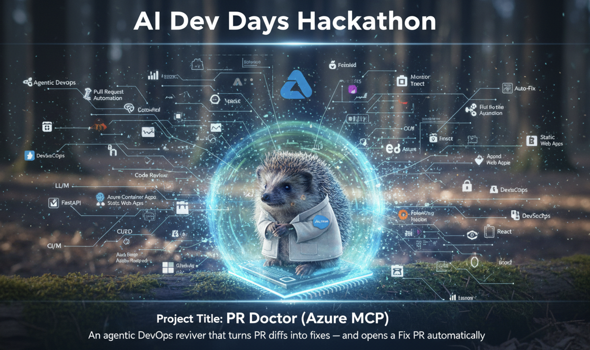
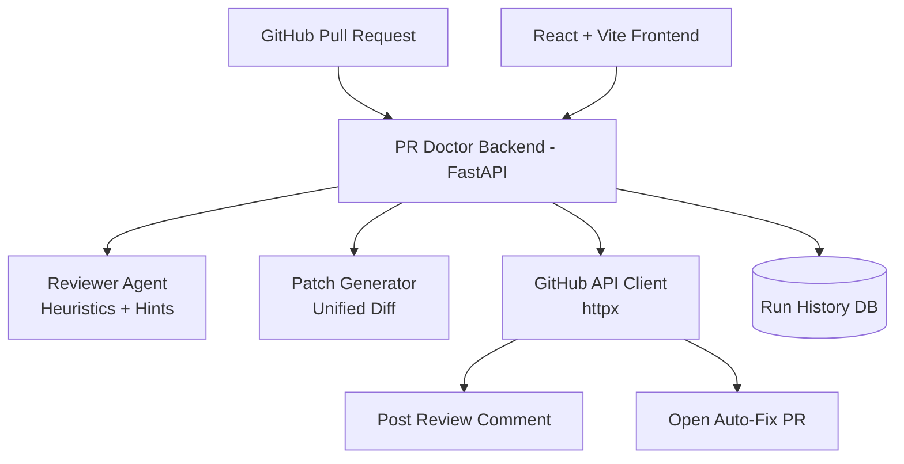
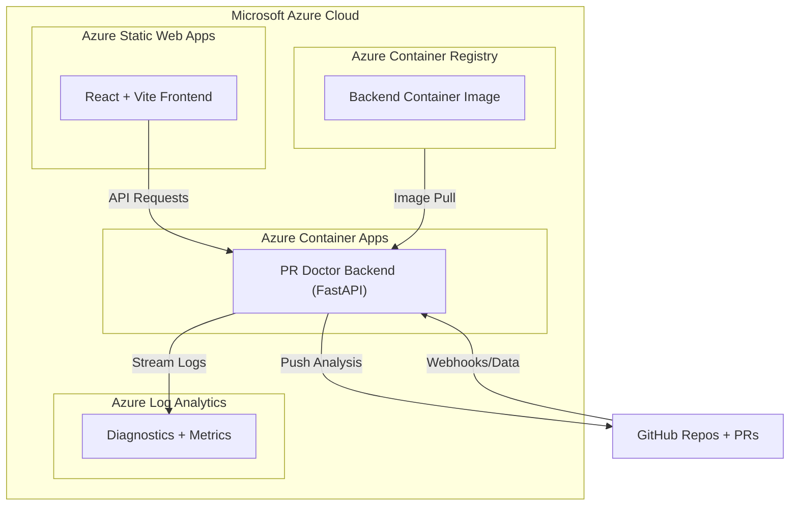

# PR Doctor 🩺 — Agentic DevOps PR Reviewer + Auto-Fix

PR Doctor is an **Agentic DevOps assistant** that helps developers and teams review GitHub Pull Requests faster and safer. It automates the analysis of high-risk patterns and proactively suggests fixes.

<p align="center">
  
</p>

<p align="center">
  
  
  
  
  
</p>

---

## 🌟 Why PR Doctor?

In modern engineering, code reviews are often the bottleneck. Busy reviewers might miss obvious security risks like leaked tokens or unsafe SQL patterns. **PR Doctor acts as your first-response reviewer.**

### **Core Capabilities**
- **Risk Analysis:** Scans for secrets, debug logs, SQL injection, and missing tests. [cite: 3]
- **Agentic Healing:** Generates a safe patch (`unified diff`) and opens an **auto-fix PR**. [cite: 3]
- **Instant Feedback:** Posts structured review comments directly on the GitHub PR. [cite: 3]
- **Run History:** Tracks every analysis in a DB-backed dashboard. [cite: 3]

---

## 🎬 Live Demo Proof

- **Demo Repo:** [M10vir/pr-doctor-demo-repo](https://github.com/M10vir/pr-doctor-demo-repo)
- **Bad PR (Test Case):** [PR #1](https://github.com/M10vir/pr-doctor-demo-repo/pull/1)
- **Auto-Fix PR (Generated):** [PR #4](https://github.com/M10vir/pr-doctor-demo-repo/pull/4)

---

## 🏗 Architecture & Flow

### **Application Logic**


### **Azure Runtime Architecture**

---

## 💻 Local Setup

### **1. Backend (FastAPI)**
Navigate to `backend/`, create a `.env` file (do not commit it), and run the server. [cite: 3]

```bash
# Create .env
cat <<EOF > .env
GITHUB_TOKEN=ghp_your_personal_access_token
ALLOWED_ORIGINS=http://localhost:5173,http://localhost:4173
EOF

# Install & Run
python -m venv .venv
source .venv/bin/activate
pip install -r requirements.txt
python -m uvicorn app.main:app --reload --port 8000
```

### **2. Frontend (React + Vite)**
Navigate to `frontend/`, set your API base URL, and start the dev server. [cite: 3]

```bash
# Set API URL
echo "VITE_API_BASE=http://localhost:8000" > .env

# Install & Run
npm install
npm run dev
```

---

## ☁️ Azure Deployment

### **Backend: Azure Container Apps**
```bash
# Build & Push Image
az acr build -r $ACR_NAME -t pr-doctor-backend:v1 ./backend

# Create Container App
az containerapp create \
  -n pr-doctor-api \
  -g pr-doctor-rg \
  --environment pr-doctor-env \
  --image $ACR_NAME.azurecr.io/pr-doctor-backend:v1 \
  --target-port 8000 \
  --ingress external

# Set Secrets
az containerapp secret set -n pr-doctor-api -g pr-doctor-rg --secrets github-token="<YOUR_TOKEN>"
```

---

## 🗺 Roadmap
- [ ] LLM-powered reviewer for complex logic analysis. [cite: 3]
- [ ] Language-aware patch generation (Java, Go, JS). [cite: 3]
- [ ] GitHub App authentication (Production grade). [cite: 3]
- [ ] Role-based access control for team dashboards. [cite: 3]

---

## 🛡 License & Contributing
This project is licensed under the **MIT License**.
Built with 🩺 for the DevOps community.

**LinkedIn:** [Mohammed10vir](https://www.linkedin.com/in/mohammed10vir)
